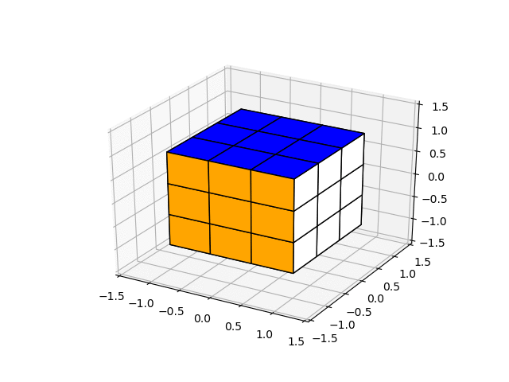

# rubiks_cube
Rubik's cube using quaternions, inspired by [3Blue1Brown's video on quaternions](https://www.3blue1brown.com/videos-blog/2018/11/8/quaternions)

To turn faces of the cube, input the color of the face's center face (first letter) followed by '+' for counter-clockwise rotation or '-' for clockwise rotation. Scramble the cube with 's'

